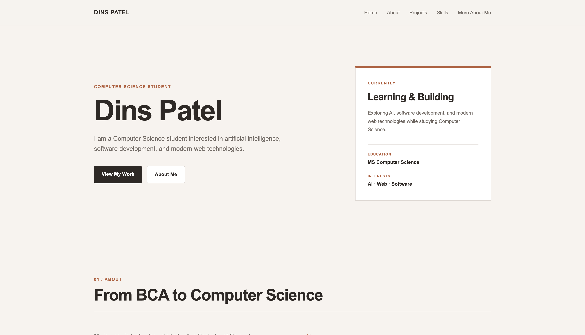
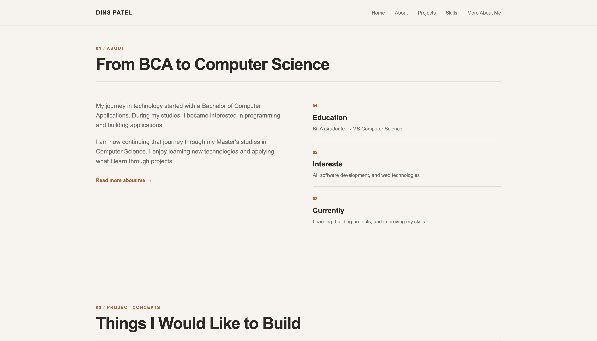
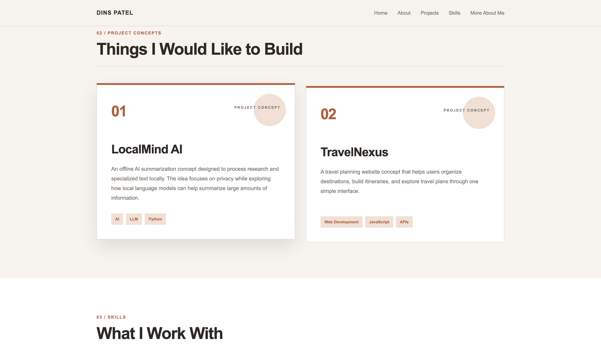
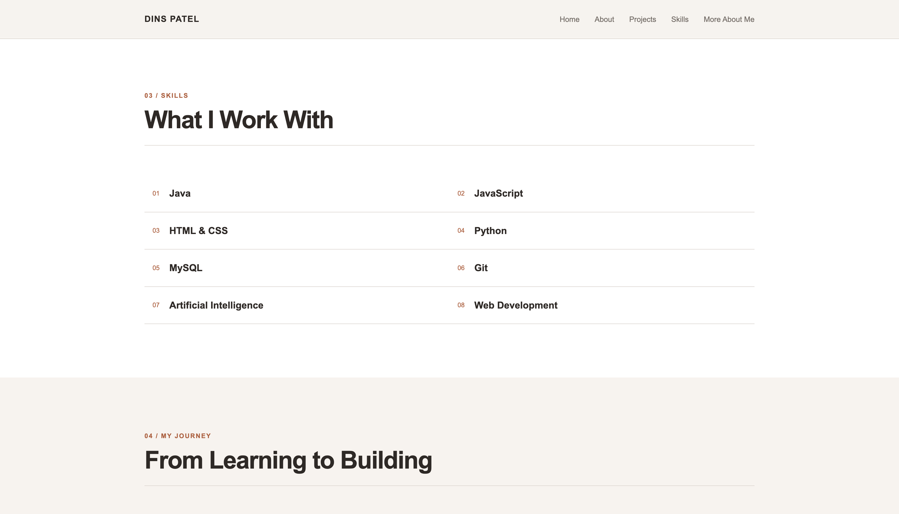
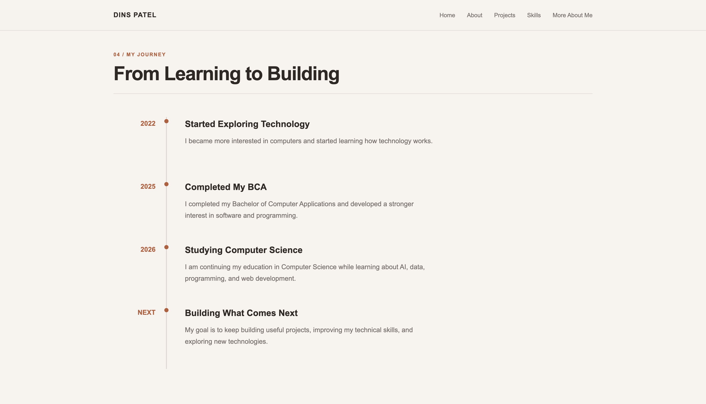

# Dins Patel — Personal Homepage

## Author

Dins Patel

## Class

CS 5610 Web Development - Prof. John Alexis Guerra Gomez - Northeastern University

## Project Objective

This project is a personal homepage built with HTML, CSS, and JavaScript ES6 modules. It introduces my Computer Science background, education, skills, interests, project concepts, and learning goals. The site includes a Home page, an About page, and an AI Creative Page with an interactive topic selector.

## Pages

- Home: index.html
- About: about.html
- AI Creative Page: ai-page.html

## Project Structure

```text
personal-homepage/
├── index.html
├── about.html
├── ai-page.html
├── css/
│   └── style.css
├── js/
│   └── main.js
├── images/
│   └── favicon.svg
├── screenshots/
│   ├── Homepage.png
│   ├── About.png
│   ├── Projects.png
│   ├── Skills.png
│   ├── Journey.png
│   ├── Current focus and Ai Creative page link.png
│   ├── More about me.png
│   └── Ai Creative Page.png
├── design/
│   └── design-document.md
├── eslint.config.js
├── package.json
├── package-lock.json
├── LICENSE
└── readme.md
```

## Demo Video

https://youtu.be/kXT0Xn2oeNQ

## Screenshot












## Run Locally

This is a static website, so no build or compilation step is required.

1. Clone or download this repository.
2. Open the project folder in VS Code.
3. Install the Live Server extension.
4. Right-click `index.html` and select **Open with Live Server**.
5. Use the navigation links to visit the About and AI Creative pages.

## Development Tools

To install the tools used to format and lint the project, run:

```sh
npm install
```

Then run `npm run format` to format the files or `npm run lint` to check the JavaScript.

## Project Checks

Format the project:

```sh
npm run format
```

Run ESLint:

```sh
npm run lint
```

## Technologies

- HTML5
- CSS3 with Flexbox and Grid
- JavaScript ES6 modules
- ESLint
- Prettier

## GenAI Use

I used OpenAI Codex with GPT-6 (the model label shown in my session) to help create the AI Creative Page. It helped me refine the page content and structure and implement the interactive topic selector for Machine Learning, Computer Vision, and Future Technology. I reviewed and adapted the suggestions.

-> Prompt Summary

“Create a page about AI and future technology for my personal homepage. Include my views on AI, areas where it can help, and an interactive section where visitors can choose a topic such as machine learning, computer vision, or future technology.”
